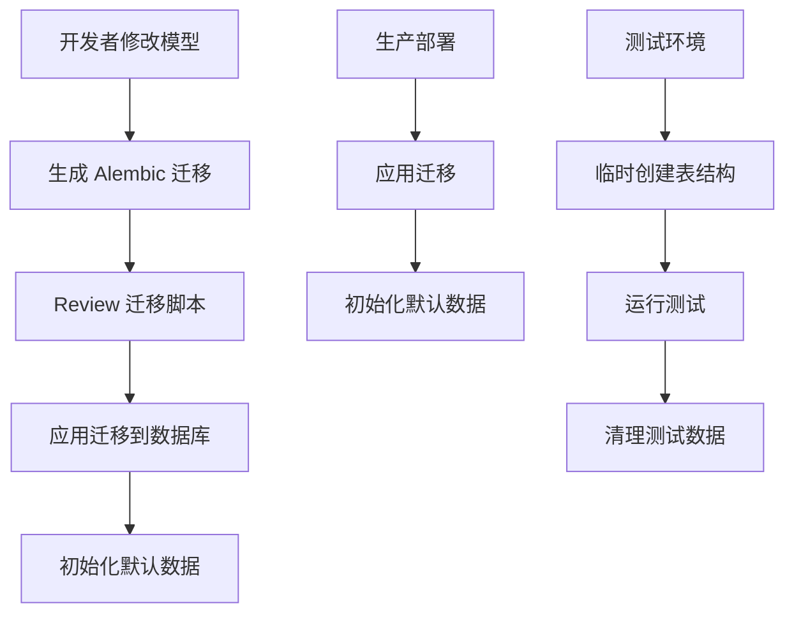

# 数据库版本管理最佳实践

## 🎯 问题和解决方案

### 原来的问题
项目中同时存在两种数据库初始化方式：
1. **直接使用 SQLAlchemy** - `Base.metadata.create_all()`
2. **Alembic 迁移系统** - 版本控制的数据库模式管理

这种双重机制导致了：
- 数据库模式管理的不一致性
- 生产环境和开发环境可能出现差异
- 违反了数据库版本管理的最佳实践

### 新的架构
现在项目采用统一的数据库管理策略：



## 🛠️ 新的工作流程

### 1. 开发环境初始化
```bash
# 首次设置
make setup-dev

# 初始化数据库（使用 Alembic）
make db-init
```

### 2. 模型变更流程
```bash
# 1. 修改模型文件（app/models/*.py）
# 2. 生成迁移脚本
make db-migrate
# 输入迁移描述，例如："Add user profile table"

# 3. 检查生成的迁移脚本
ls alembic/versions/

# 4. 应用迁移
make db-upgrade
```

### 3. 数据库管理命令

#### 基本操作
- `make db-init` - 🗃️ 初始化数据库（迁移 + 默认数据）
- `make db-migrate` - 📝 创建新的数据库迁移
- `make db-upgrade` - ⬆️ 应用待处理的迁移
- `make db-current` - 📍 查看当前数据库版本

#### 历史和调试
- `make db-history` - 📋 查看迁移历史
- `make db-downgrade` - ⬇️ 回滚数据库迁移

#### 危险操作
- `make db-reset` - ⚠️ 重置整个数据库（开发环境）

## 📁 文件结构

### 迁移文件
```
alembic/
├── versions/           # 迁移脚本存储
│   └── 666ec5a24c4c_initial_database_schema.py
├── env.py             # Alembic 环境配置
└── script.py.mako     # 迁移脚本模板
```

### 核心文件变更
- `scripts/init_db.py` - ✅ 重构为使用 Alembic
- `app/db/crud.py` - ✅ 分离数据初始化逻辑
- `Makefile` - ✅ 添加数据库管理命令

## 🔄 迁移策略

### 开发环境
```bash
# 每次模型变更后
make db-migrate
make db-upgrade
```

### 生产环境
```bash
# 部署时自动运行
alembic upgrade head
python scripts/init_db.py  # 仅初始化默认数据
```

### 测试环境
- 继续使用 `create_all()` 进行快速表创建
- 测试后自动清理，不影响迁移历史

## ⚠️ 重要注意事项

### 1. 废弃的函数
`app.db.crud.init_db()` 已标记为 **DEPRECATED**：
```python
# ❌ 旧方式（已废弃）
await init_db(db)

# ✅ 新方式
# 1. 使用 Alembic 管理模式: make db-upgrade
# 2. 使用新函数初始化数据: await init_default_data(db)
```

### 2. 测试环境例外
测试环境为了性能考虑，仍然使用 `create_all()`：
- 在 `conftest.py` 中保留
- 每次测试后自动清理
- 不影响实际数据库迁移

### 3. 生产环境检查清单
- [ ] 确保所有迁移都已审查
- [ ] 在 staging 环境测试迁移
- [ ] 备份生产数据库
- [ ] 应用迁移：`alembic upgrade head`
- [ ] 验证数据完整性

## 🚀 优势

1. **一致性**: 所有环境使用相同的数据库模式管理方式
2. **版本控制**: 所有数据库变更都有版本历史记录
3. **可回滚**: 支持安全的数据库模式回滚
4. **团队协作**: 数据库变更可以通过代码 review
5. **自动化**: 支持 CI/CD 流程中的自动数据库升级

## 📚 参考资源

- [Alembic 官方文档](https://alembic.sqlalchemy.org/)
- [SQLAlchemy 迁移最佳实践](https://docs.sqlalchemy.org/en/20/orm/extensions/alembic.html)
- [FastAPI 数据库迁移指南](https://fastapi.tiangolo.com/tutorial/sql-databases/#create-the-alembic-configuration)

## 🔮 后续计划

- [ ] 添加数据库备份/恢复命令
- [ ] 集成到 CI/CD 流程
- [ ] 添加数据库健康检查
- [ ] 支持多环境迁移策略